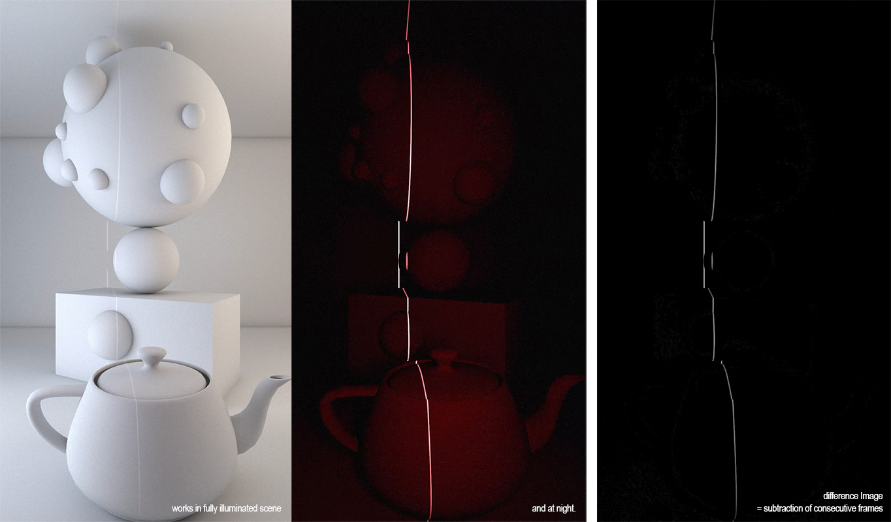
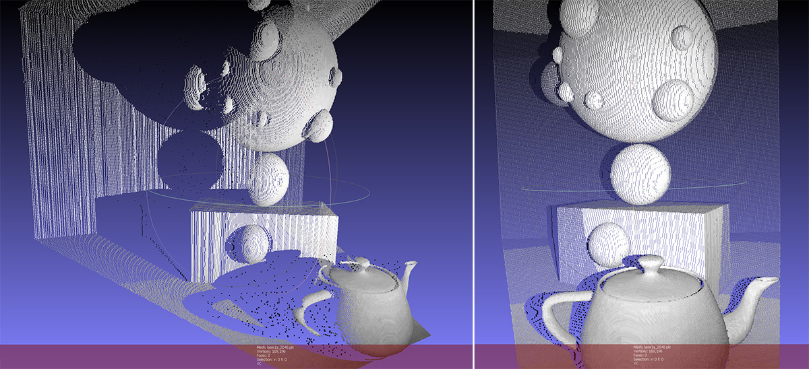

# LineScanner

### working principle
A stepper motor sweeps a linelaser across the view of a camera. The script tries to detect a laser line 
in each row of the camera frame, repeating for each frame during the laser's motion. 
It uses frame subtraction to detect subtle changes in brightness and can therefore be used even in bright daylight.

It then triangulates the 3D position of each point of the laser line using:
* distance between camera <-> laser
* current angle of the laser's stepper motor
* camera intrinic parameters (currently only field-of-view, later also distortion)

Each point is colored (Vertex Color) either by the point's grayscale-value ( = "Laser-Illuminated") 
or by providing a clean image for texturing (e.g. first frame of daylight shooting).

-----------

LINKS:
Vector Intersection based on [geomalgorithms.com](https://web.archive.org/web/20210428000731/http://geomalgorithms.com/a05-_intersect-1.html)
    https://stackoverflow.com/questions/5666222/3d-line-plane-intersection

indices of max-values in numpy array
    https://www.w3resource.com/python-exercises/numpy/python-numpy-exercise-31.php

weighted average
    https://stackoverflow.com/questions/30057046/weighted-mean-in-numpy-python#30057626

color:
https://github.com/isl-org/Open3D/issues/614

pcd = PointCloud()
pcd.points = Vector3dVector(np_points)
pcd.colors = Vector3dVector(np_colors)
